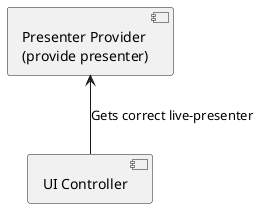

前面简单地分析了一下 `Android-ViewModel` 和 `LiveData` 的使用，然后突然脑洞一开就想封装个生命周期相关的 `Presenter` 组件，这就是今天这篇的主题了
<!-- more -->
- - -

上一篇有说到 __MVP__ 的各种确定，为什么还要对 __MVP__ 的组件再来做文章呢  
原因很简单  
因为软件开发不存在银弹，__MVVM__ 跟 __MVP__ 都是软件代码架构上的一种思想，选择方案的时候只有适不适合  

事实上实际开发中我自己不会单纯的使用某一种架构，而是会根据实际场景来选择跟合适的方案  
像个人信息页面这种比较符合 `MVVM` 数据驱动的页面会考虑用 `ViewModel` + `LiveData` 的方法来简化代码  
但是像一些复杂的业务逻辑为主的场景，更多的还是会考虑用 `Presenter` 来封装，还有一个原因就是至少目前来说，`MVP` 的架构思想在国内还是占据主流的，`ViewModel` 毕竟还是没有完全普及开

OK, 扯淡结束，下面开始正题

## LivePresenter 的设计

关于这个的想法其实主要是受到了 `ViewModel` 模式的启发，`Presenter` 因为设计本身的原因需要与 `View` 层对象相互持有产生循环引用  
传统的解决方式一般是封装一个 `BasePresenter` 以及 `BaseActivity` `BaseFragment` 什么的，需要在生命周期对应的回调里做各种处理（本人以前也是这么干的，封装了一堆有的没的方法）  

熟悉了 __Android Lifecycle__ 的机制以后就觉得这种处理太不优雅，而且耦合性也太高了，所以就有了下面的想法

